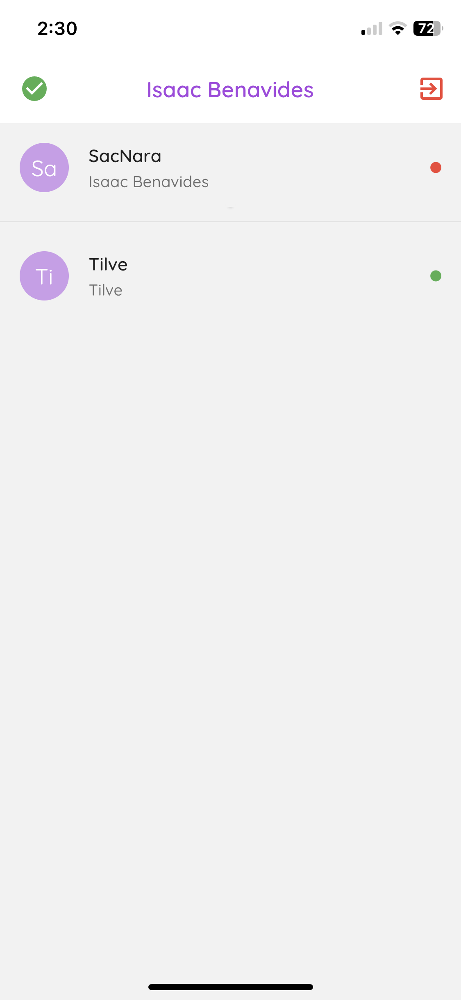
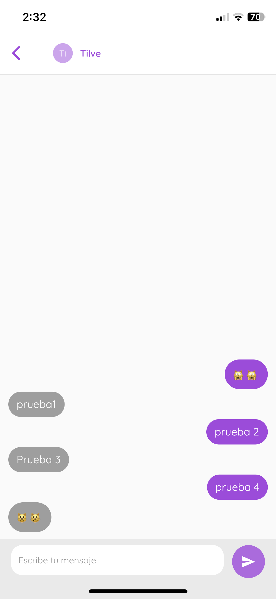

# Chat Application Flutter and Node

## `Screen Shots`

<table style="padding:10px">
  <tr>
    <td> 
         
    </td>
    <td> 
         
    </td>
    <td> 
         
    </td>
  </tr>
  <tr>
    <td> 
         
    </td>
    <td> 
         
    </td>
  </tr>
</table>
